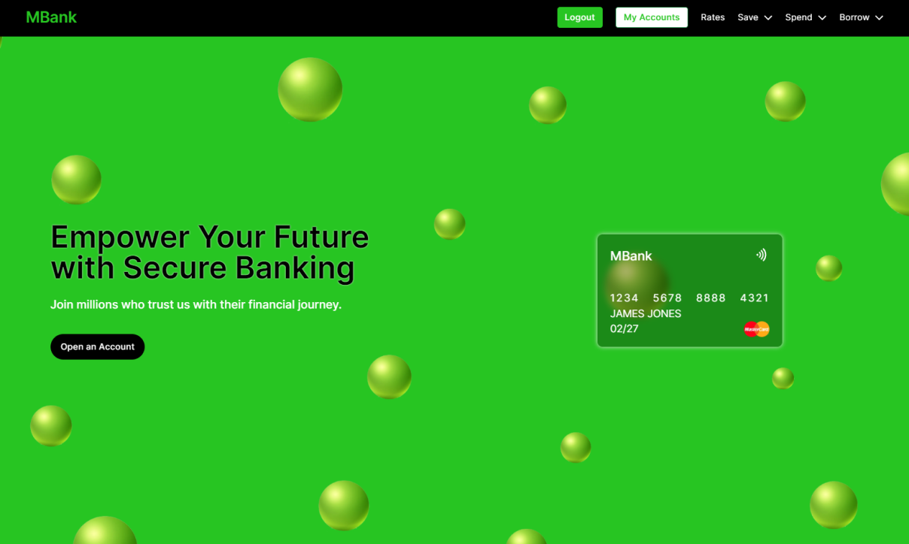

## MBank Financial

An online banking app. Clients can login and potential clients can sign-up.

Clients can move money between their accounts. They can also make payments and add payees from a list. Transactions are displayed, and can be filtered by date, amount, and by entity (e.g. Walmart).

### Tools

- NextJS
- TypeScript
- JavaScript ES6
- Tailwind CSS
- Shadcn/ui
- MongoDB
- Mongoose
